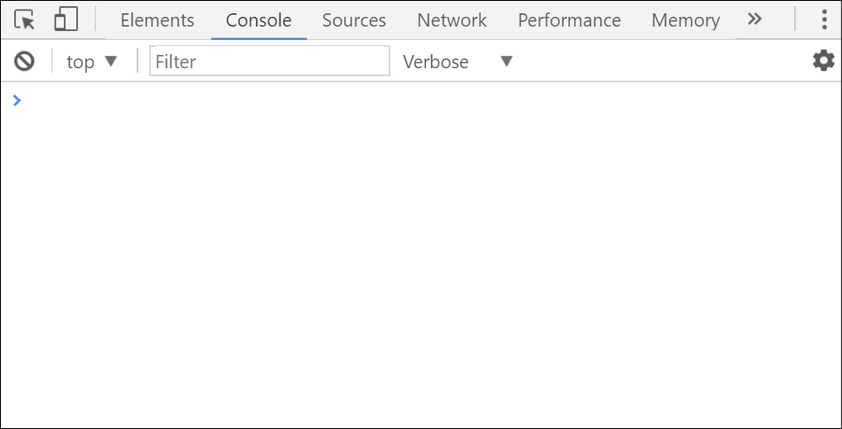
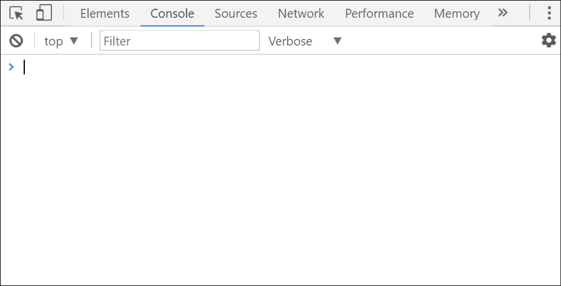

Neste artigo vou demonstrar algumas funcionalidades que o `console` possui para auxiliar no dia-a-dia dos desenvolvedores.

- Introdução
- console.log()
- console.clear()
- console.info()
- console.warn()
- console.error()
- console.table()
- console.group(), console.groupCollapsed() e console.groupEnd()
- console.time() e console.timeEnd()
- Conclusão

## Introdução

O `console` é um grande aliado do desenvolvedor. Eu mesmo utilizo o `console` em todas as fases do desenvolvimento dos meus projetos.

Participando de um projeto com um amigo, ele ficou surpreso quando utilizei algumas funcionalidades que ele não conhecia. Com base nisso, resolvi escrever esse artigo para falar um pouco sobre o poder do `console`.

Nos tópicos abaixo, vou mostrar algumas funcionalidades que talvez a maioria ainda não conheça ou não utilize.

## console.log()

Essa é a forma mais comum de utilizar o `console`. O método exibe uma saída básica com a mensagem que foi passada como parâmetro.

```javascript
console.log('Eu sou o Batman!');
```



Há outras formas de enviar a mensagem:

- Utilizando `interpolation`, o símbolo `%s` é substituído pelo valor do segundo parâmetro.

```javascript
console.log('Eu sou o %s!', 'Batman');
```



Podemos utilizar variáveis também:

```javascript
const hero = 'Batman';

console.log('Eu sou o %s!', hero);
```


- Utilizando `Template Strings`, uma nova funcionalidade do ES6.

Reparem que nesse caso não estamos utilizando aspas simples, estamos utilizando crase. `${hero}` será substituído pelo conteúdo da variável `hero`.

```javascript
const hero = 'Batman';

console.log(`Eu sou o ${hero}!`);
```


- Utilizando estilos com o uso do símbolo `%c`.

```javascript
const style = 'color: red; font-size: 24px';

console.log('%c Eu sou o Batman!', style);
```


## console.clear()

Essa opção limpa o `console`.

```javascript
console.log('Eu sou o Superman!');
console.log('Eu sou o Flash!');
console.clear();
console.log('Eu sou o Batman!');
```


## console.info()

Essa opção é idêntica à `console.log()`.

```javascript
console.info('Eu sou o Batman!');
```


## console.warn()

Essa opção inclui um símbolo de aviso na frente da mensagem e altera a cor para amarelo.

```javascript
console.warn('Não se meta com o Batman!');
```


## console.error()

Essa opção inclui um símbolo de erro na frente da mensagem e altera a cor para vermelho.

```javascript
console.error('O Batman está furioso!');
```


## console.table()

Imagine que você precise exibir um `array` na saída do `console`, normalmente você faria isso:

```javascript
const heroes = [
  { name: 'Superman', power: 'Eu posso voar!' },
  { name: 'Flash', power: 'Eu sou muito rápido!' },
  { name: 'Batman', power: 'Eu sou rico!' }
];

console.log(heroes);
```


No lugar de `console.log()`, experimente utilizar `console.table()`.

```javascript
const heroes = [
  { name: 'Superman', power: 'Eu posso voar!' },
  { name: 'Flash', power: 'Eu sou rápido!' },
  { name: 'Batman', power: 'Eu sou rico!' }
];
console.table(heroes); // <-- Wow
```


## console.group(), groupCollapsed() e groupEnd()

Essas opções agrupam as saídas no `console`. O nome do agrupamento deve ser igual em `group()` e `groupEnd()`.

```javascript
const heroes = [
  { name: 'Superman', power: 'Eu posso voar!' },
  { name: 'Flash', power: 'Eu sou rápido!' },
  { name: 'Batman', power: 'Eu sou rico!' }
];

heroes.forEach((hero) => {
  console.group(`${hero.name}`);
  console.log(`Nome: ${hero.name}`);
  console.log(`Poder: ${hero.power}`);
  console.groupEnd(`${hero.name}`);
});
```


A única diferença entre `group()` e `groupCollapsed()` é que o último mantém o agrupamento fechado.


## console.time() e console.timeEnd()

Essa opção serve para medir a quantidade de tempo que foi gasta em um determinado processamento. O nome do `timer` deve ser igual em `time()` e `timeEnd()`.

```javascript
console.time('Processamento');

fetch('https://api.github.com/users/robertoachar')
  .then((data) => data.json())
  .then((data) => {
    console.timeEnd('Processamento');
    console.log(data);
  });
```


## Conclusão

Ainda está surpreso com `console.table()`, não é? Também fiquei assim quando utilizei pela primeira vez. Existem outras funcionalidades que não mencionei no artigo para não ficar extenso.

Espero que tenham gostado e possam aplicar essas funcionalidades no seu dia-a-dia.
