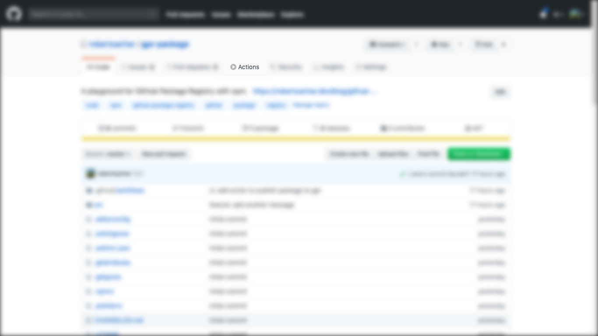
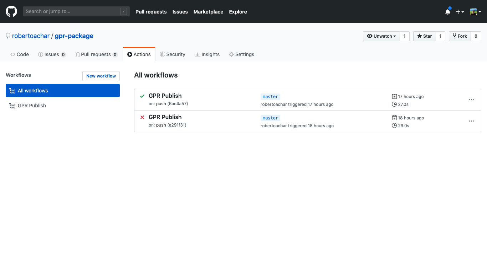
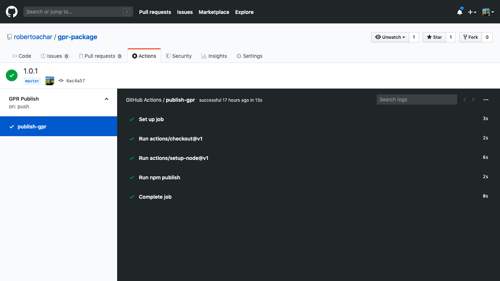
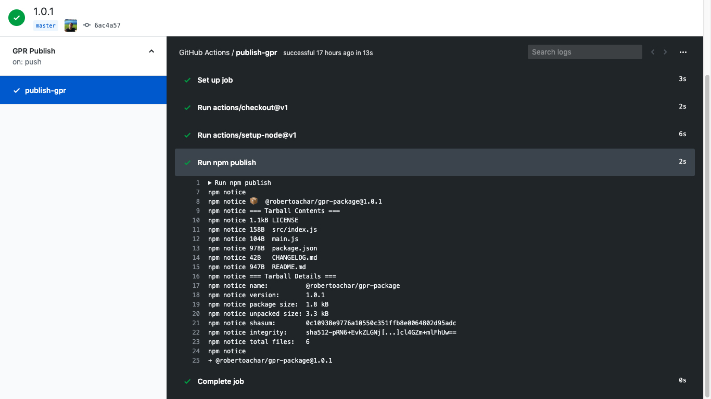

- Introdução
- O que é GitHub Actions?
- O que é GitHub Package Registry?
- Definindo o workflow
- Criando um workflow para publicar pacotes no GitHub Package Registry usando o GitHub Actions
- Enviando o workflow para o GitHub
- Acompanhando a execução do workflow
- Conclusão
- Solução de problemas

## Introdução

As práticas de _Continuous Integration_ e _Continuous Delivery_, também conhecidas com CI/CD, tem se tornado cada vez mais presentes no _workflow_ dos desenvolvedores. Essas técnicas consistem em integrar código com mais frequência ao repositório, permitindo que os desenvolvedores descubram erros mais rapidamente, por exemplo. Existe outros benefícios, é claro.

Existem serviços de CI/CD disponíveis na Internet que permitem que os desenvolvedores construam seus _workflows_ de CI/CD. Os mais conhecidos e utilizados são: [CircleCI](https://circleci.com) e [Travis CI](https://travis-ci.org/).

Um _workflow_ muito utilizado pelos desenvolvedores JavaScript é utilizar o **GitHub** para gerenciar o código, **CircleCI** ou **Travis CI** para gerenciar o CI/CD e o **npm** para publicar os pacotes.

## O que é GitHub Actions?

**GitHub Actions** é uma das novas funcionalidades que o GitHub lançou recentemente. A proposta é disponibilizar um serviço de CI/CD dentro do GitHub. 👀

Para utilizar o GitHub Actions é necessário criar um arquivo `YAML` no diretório `.github/workflows`. Assim que o arquivo for criado no repositório, o GitHub identifica esse arquivo e executa o _workflow_.

No _workflow_ podemos configurar a execução de testes, _build_ e _deploy_, por exemplo.

> Essa funcionalidade ainda está em fase `beta`. Caso você queira se inscrever para participar, acesse a [página do GitHub Actions](https://github.com/features/actions).

## O que é GitHub Package Registry?

O **GitHub Package Registry** é um serviço de hospedagem de pacotes, semelhante ao `npm`, que permite que você hospede seus códigos e pacotes em um único lugar. Ele suporta pacotes do `Node.js`, `Ruby`, `Java`, `.NET` e imagens `Docker`.

Esse tutorial é a continuação do tutorial anterior [Como utilizar o GitHub Package Registry com o npm](/blog/github-package-registry-npm).

## Definindo o _workflow_

Nosso objetivo é simples: publicar um pacote automaticamente sempre que houver uma alteração na _branch master_. Os passos necessários para isso são:

- Identificar uma alteração na _branch master_ seja através de `push` ou `Pull Request`
- Executar algumas ações para publicar o pacote

## Criando um _workflow_ para publicar pacotes no GitHub Package Registry usando o GitHub Actions

O primeiro passo para criar um _workflow_ no GitHub Actions é criar um arquivo no diretório `.github/workflows`. O nome do arquivo pode ser qualquer coisa, desde que tenha a extensão `.yml`. Eu vou utilizar `gpr-publish.yml`. Eu vou apresentar o arquivo completo e comentar todas as etapas detalhadamente.

```yaml
name: GPR Publish

on:
  pull_request:
    branches:
      - master
  push:
    branches:
      - master

jobs:
  publish-gpr:
    runs-on: ubuntu-latest
    steps:
      - uses: actions/checkout@v1
      - uses: actions/setup-node@v1
        with:
          node-version: 12
          registry-url: https://npm.pkg.github.com/
          scope: '@robertoachar'
      - run: npm publish
        env:
          NODE_AUTH_TOKEN: ${{secrets.GITHUB_TOKEN}}
```

### Nome do _workflow_

Esse é o nome que será exibido no GitHub para identificar o _workflow_.

```yaml
name: GPR Publish
```

### Definindo a condição para a execução do _workflow_

Essa configuração instrui o _workflow_ a ser executado apenas quando houver um `Pull Request` ou um `Push` na _branch_ **master**.

```yaml
on:
  pull_request:
    branches:
      - master
  push:
    branches:
      - master
```

### Definindo o job

Todo _workflow_ precisa ter pelo menos um _job_ e podemos definir mais de um _job_ por _workflow_. Nesse caso estamos definindo apenas um _job_: `publish-gpr`. Esse _job_ será executado sempre que a condição acima for atendida.

```yaml
jobs: publish-gpr:
```

### Escolhendo o ambiente de execução

Os _workflows_ podem ser executados em uma máquina virtual ou em um _container_ Docker. Nesse caso iremos executar o _workflow_ em uma máquina virtual com a última versão do sistema operacional `Ubuntu`.

```yaml
runs-on: ubuntu-latest
```

### Passos da execução

Um _job_ contém um mais passos a serem executados. Os passos podem ser a execução de comandos ou utilizar uma ação.

```yaml
steps:
```

### Ação `checkout`

A ação `checkout` é uma ação padrão e precisa ser incluída antes das outras ações. Ela é responsável por requisitar uma cópia do código do repositório.

```yaml
- uses: actions/checkout@v1
```

### Ação `setup-node`

Essa ação é responsável por configurar o `Node` no ambiente de execução. Solicitamos a instalação da versão 12 do `Node.js`, informamos qual é a `url` do `registry` e informamos qual é o `scope` (leia nome de usuário ou organização do GitHub).

```yaml
- uses: actions/setup-node@v1
  with:
    node-version: 12
    registry-url: https://npm.pkg.github.com/
    scope: '@robertoachar'
```

### Publicando o pacote

Informamos ao _workflow_ para executar o comando `npm publish` e configuramos a variável de ambiente `NODE_AUTH_TOKEN` com o valor de `GITHUB_TOKEN`. O GitHub cria `GITHUB_TOKEN` por padrão, mas precisamos incluí-lo nas configurações para que as ações possam usá-lo.

```yaml
- run: npm publish
  env:
    NODE_AUTH_TOKEN: ${{secrets.GITHUB_TOKEN}}
```

## Enviando o _workflow_ para o GitHub

Como o _workflow_ é apenas um arquivo no repositório, para enviar o _workflow_ para o GitHub, basta realizar o _commit_ desse arquivo no repositório. Se esse arquivo for enviado para a _branch master_ através de `push` ou `Pull Request`, o _job_ será executado e seu pacote será publicado automaticamente.

## Acompanhando a execução do _workflow_

1. Acesse a página do seu repositório no GitHub

2. Clique em `Actions`



3. Visualize todos os _workflows_ disponíveis



4. Clique em um _workflow_ para ver os detalhes



5. Clique em uma etapa para visualizar o `log` de execução



## Conclusão

O GitHub vem se tornando cada vez mais uma ferramenta indispensável para os desenvolvedores. Essas duas novas funcionalidades, GitHub Actions e GitHub Package Registry, agregam muito valor ao ciclo de desenvolvimento.

## Solução de problemas

### Recebi o erro `EPUBLISHCONFLICT` na hora de publicar o pacote

```bash
$ npm publish

npm ERR! code EPUBLISHCONFLICT
npm ERR! publish fail Cannot publish over existing version.
npm ERR! publish fail Update the 'version' field in package.json and try again.
npm ERR! publish fail
npm ERR! publish fail To automatically increment version numbers, see:
npm ERR! publish fail     npm help version
```

**Solução**: você não pode publicar um pacote com a mesma versão que já foi publicada. Altere a versão do seu pacote e tente publicar novamente.
