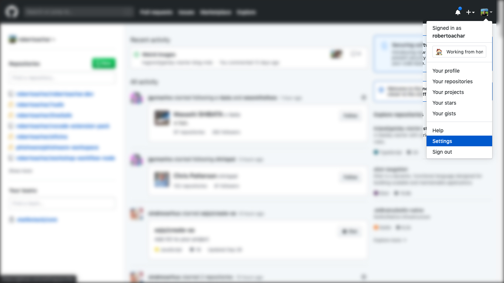
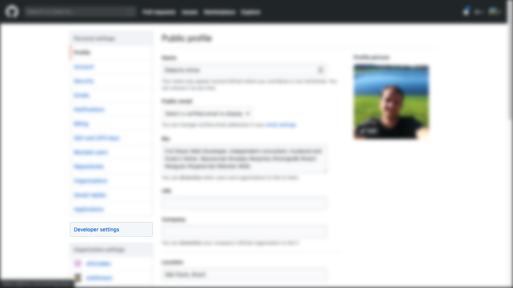
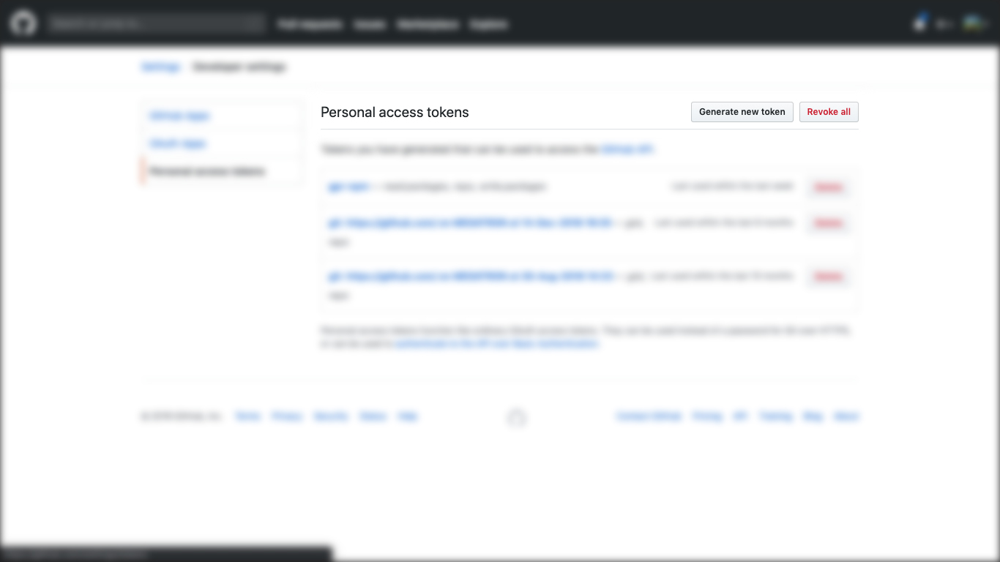
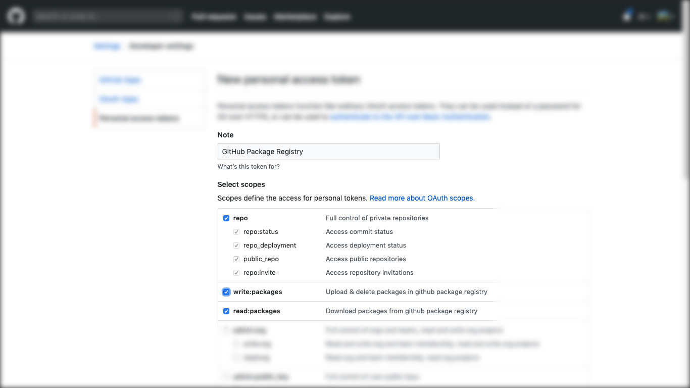
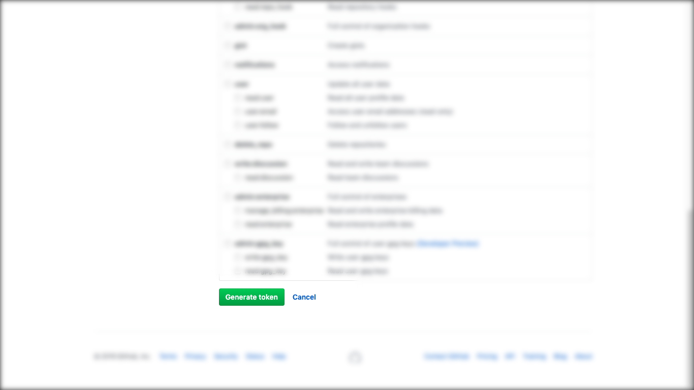
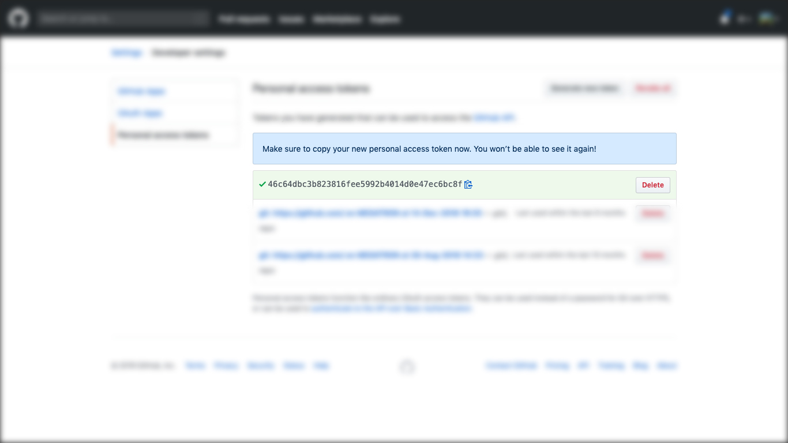
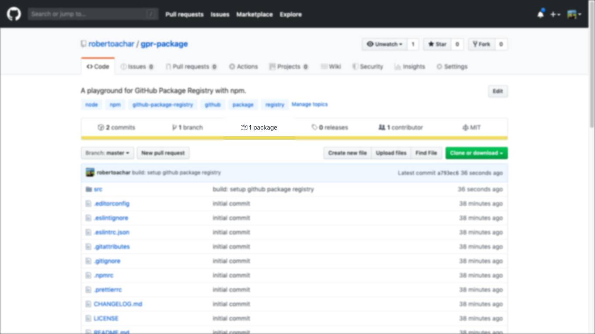
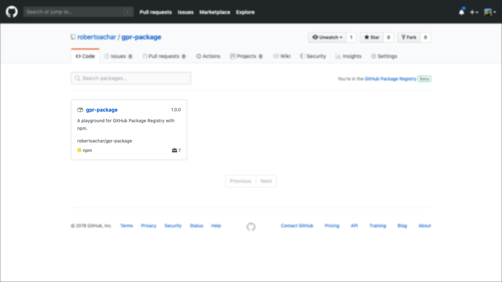
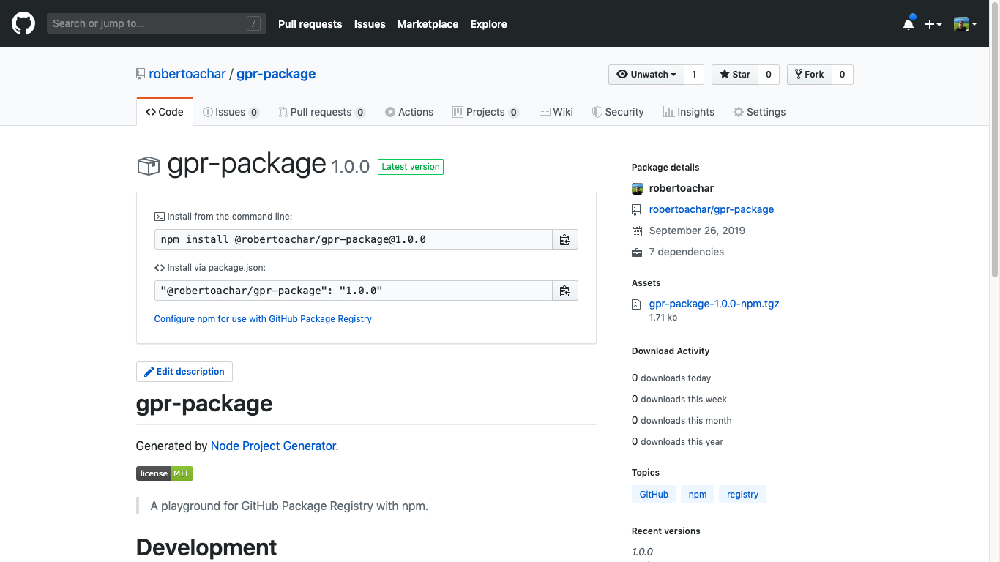

- Introdução
- O que é GitHub Package Registry?
- Autenticando no GitHub Package Registry com o npm
- Publicando um pacote
- Instalando um pacote
- Conclusão
- Solução de problemas

## Introdução

A instalação padrão do `Node.js`, instala o `npm` - Node Package Manager ou Gerenciador de Pacotes do Node. O `npm` é o maior e mais utilizado serviço de hospedagem de pacotes do `Node.js` no mundo. Ele consiste de 03 componentes:

- **Website**: utilizado para procurar e gerenciar pacotes

- **CLI**: um utilitário de linha de comando para interagir com o `npm`

- **Registry**: um banco de dados de pacotes disponíveis para o `Node.js`

Quando precisamos instalar algum pacote do `Node.js`, procuramos o pacote no Website e instalamos utilizando o utilitário de linha de comando.

Mas como o Website e o utilitário sabem onde encontrar os pacotes?

Resposta: `Registry`.

A instalação do `npm` vem com algumas configurações padrões. Uma dessas configurações é o endereço do `registry`. Para exibir todas as configurações padrões no `npm`, abra o `Terminal` e digite:

```bash
$ npm config ls -l

...
registry = "https://registry.npmjs.org/"
...
```

Agora sabemos como o `npm` sabe onde encontrar os pacotes. Isso quer dizer que podemos utilizar outro serviço de hospedagem de pacotes para o `Node.js`? Sim.

## O que é GitHub Package Registry?

No dia 10 de maio de 2019, o GitHub anunciou sua mais nova funcionalidade: **GitHub Package Registry**.

https://twitter.com/github/status/1126949311848288256?s=20

O **GitHub Package Registry** é um serviço de hospedagem de pacotes, semelhante ao `npm`, que permite que você hospede seus códigos e pacotes em um único lugar. Ele suporta pacotes do `Node.js`, `Ruby`, `Java`, `.NET` e imagens `Docker`.

> Essa funcionalidade ainda está em fase `beta`. Caso você queira se inscrever para participar, acesse a [página do GitHub Package Registry](https://github.com/features/package-registry).

## Autenticando no GitHub Package Registry com o npm

O primeiro passo para utilizar o GitHub Package Registry, é criar um token de autenticação com permissão de leitura/escrita nos pacotes.

Para criar o Token de autenticação:

1. Faça o login no site do [GitHub](https://github.com/)

2. No canto superior direito, clique na sua foto e depois em **Settings**



3. No menu esquerdo, clique em **Developer Settings**



4. No menu esquerdo, clique em **Personal access tokens**


5. Clique no botão **Generate new token**



6. Informe a descrição do token (Ex.: GitHub Package Registry) e selecione os escopos **write:packages** e **read:packages** (o escopo **repo** será automaticamente selecionado para publicar pacotes privados)



7. Clique no botão **Generate token** no final da página



8. Copie o token

> O token não será exibido novamente. Se você não conseguiu copiar o token, você terá que gerar outro.



9. Crie ou edite o aquivo `~/.npmrc` e substitua `PERSONAL-ACCESS-TOKEN` pelo seu token. O arquivo `~/.npmrc` é responsável pelas configurações globais do `npm`.

```text
//npm.pkg.github.com/:_authToken=PERSONAL-ACCESS-TOKEN
```

## Publicando um pacote

Para esse tutorial eu vou utilizar dois repositórios:

1. [`gpr-package`](https://github.com/robertoachar/gpr-package) é o repositório que contém o código do pacote que será publicado no GitHub Package Registry

2. [`gpr-project`](https://github.com/robertoachar/gpr-project) é o repositório que contém o código que utilizará o pacote publicado

Antes de publicar o pacote, precisamos fazer algumas alterações no repositório `gpr-package`.

### Configurando o `name`

Precisamos verificar o nome do pacote no arquivo `package.json`. O **GitHub Package Registry** suporta apenas pacotes do `npm` com escopo. O formado de um pacote com escopo é `@owner/name`. `owner` é o nome do seu usuário ou organização do GitHub e `name` é o nome do repositório. No meu caso o nome do pacote será `@robertoachar/gpr-package`.

```json
{
  "name": "@robertoachar/gpr-package"
}
```

### Configurando o `repository`

O campo `repository` precisa ser idêntico à url do seu repositório do GitHub.

```json
{
  "repository": {
    "type": "git",
    "url": "https://github.com/robertoachar/gpr-package.git"
  }
}
```

### Configurando o `registry`

Há duas maneiras de configurar o pacote para ser publicado no GitHub Package Registry:

1. Através do arquivo `.npmrc` local do projeto.

```text
registry=https://npm.pkg.github.com/robertoachar
```

2. Atráves do campo `publishConfig` do arquivo `package.json`.

```json
{
  "publishConfig": {
    "registry": "https://npm.pkg.github.com/"
  }
}
```

### Publicando o pacote

Para finalizar a publicação, execute:

```bash
$ npm publish
```

### Visualizando o pacote

Para verificar se o pacote foi publicado com sucesso, acesse a página do repositório no GitHub e verifique se exite pacote disponível.



Clique no link `1 package` para exibir todos os pacotes disponíveis nesse repositório.



Clique no nome do pacote para exibir os detalhes do pacote.



## Instalando um pacote

Instalar pacotes do GitHub Package Registry é similar à instalação de pacotes do `npm`. Antes de instalar o pacote, precisamos fazer uma configuração no repositório `gpr-project`.

- Crie ou edite o arquivo `.npmrc` e informe o endereço do `registry` do GitHub

```text
registry=https://npm.pkg.github.com/robertoachar
```

- Instale o pacote com o `npm`

```bash
$ npm i @robertoachar/gpr-package
```

- Use o pacote no projeto

```js
import hello from '@robertoachar/gpr-package';

hello();
```

## Conclusão

Agora temos uma nova alternativa para publicar e disponbilizar pacotes para o `Node.js`. 😉

Próximos passos:

- Leia o [artigo sobre a introdução do GitHub Package Registry](https://github.blog/2019-05-10-introducing-github-package-registry/) no blog do GitHub.

- Leia a [documentação do GitHub Package Registry](https://help.github.com/en/articles/about-github-package-registry)

- Visite a [página do GitHub Package Registry](https://github.com/features/package-registry) para conhecer mais sobre a nova funcionalidade e se inscrever no _open beta_.

## Solução de problemas

Relacionei alguns problemas que podem ocorrer na integração do GitHub Package Registry com o `npm`.

### Recebi o erro `Unable to authenticate` na hora de publicar o pacote

```bash
npm ERR! code E401
npm ERR! Unable to authenticate, need: Basic realm="GitHub Package Registry"
```

**Solução**: provavelmente você não configurou o arquivo `~/.npmrc` corretamente.

### Recebi o erro `401 Unauthorized` na hora de publicar o pacote

```bash
npm ERR! code E401
npm ERR! 401 Unauthorized - PUT https://npm.pkg.github.com/@robertoachar%2fgpr-package - Your token has not been granted the required scopes to execute this query. The 'createRegistryPackageVersion' field requires one of the following scopes: ['write:packages'], but your token has only been granted the: [''] scopes. Please modify your token's scopes at: https://github.com/settings/tokens.
```

**Solução**: seu token não tem permissão de escrita/leitura de pacotes. Acesse as configurações do seu token, verifique se as permissões estão corretas, salve as permissões e tente publicar seu pacote novamente.

### Recebi o erro `400 Bad Request` na hora de publicar o pacote

```bash
$ npm publish

npm ERR! code E400
npm ERR! 400 Bad Request - PUT https://npm.pkg.github.com/@robertoachar%2fgpr-package - RepoAcceptsPackageUploads: Unauthorized access. Please check to ensure your token has access to read this repository.
```

**Solução**: o token informado no arquivo `~/.npmrc` é inválido. Gere um novo token, cole no arquivo `~/.npmrc` e tente publicar seu pacote novamente.

### Recebi o erro `EPUBLISHCONFLICT` na hora de publicar o pacote

```bash
$ npm publish

npm ERR! code EPUBLISHCONFLICT
npm ERR! publish fail Cannot publish over existing version.
npm ERR! publish fail Update the 'version' field in package.json and try again.
npm ERR! publish fail
npm ERR! publish fail To automatically increment version numbers, see:
npm ERR! publish fail     npm help version
```

**Solução**: você não pode publicar um pacote com a mesma versão que já foi publicada. Altere a versão do seu pacote e tente publicar novamente.

### Recebi o erro `404 Not Found` na hora de instalar o pacote

```bash
$ npm i @robertoachar/gpr-package

npm ERR! code E404
npm ERR! 404 Not Found - GET https://registry.npmjs.org/@robertoachar%2fgpr-package - Not found
npm ERR! 404
npm ERR! 404  '@robertoachar/gpr-package@latest' is not in the npm registry.
npm ERR! 404 You should bug the author to publish it (or use the name yourself!)
npm ERR! 404
npm ERR! 404 Note that you can also install from a
npm ERR! 404 tarball, folder, http url, or git url.
```

**Solução**: provavelmente você esqueceu de informar o `registry` do GitHub no arquivo `.npmrc` do projeto. Adicione `registry=https://npm.pkg.github.com/OWNER` no arquivo `.npmrc`, substitua `OWNER` pelo seu usuário do GitHub, salve o arquivo e tente instalar o pacote novamente.
