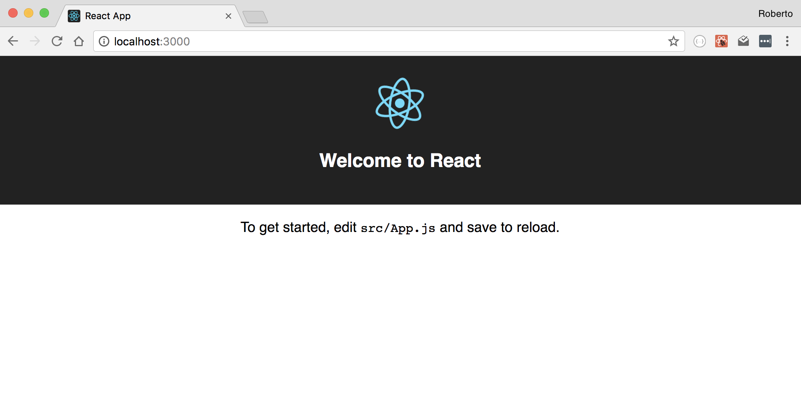
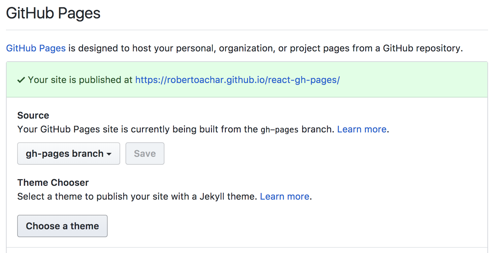
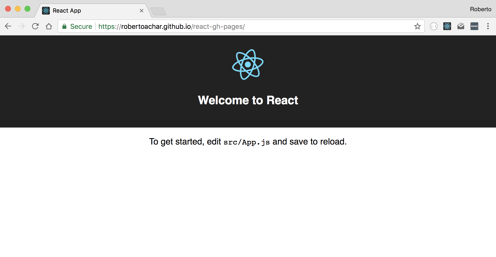

- Introdução
- Instalação das ferramentas
- Criando o repositório da aplicação
- Criando a aplicação
- Fazendo deploy no GitHub Pages
- Conclusão

## Introdução

Muitos desenvolvedores não conhecem a funcionalidade `Pages` do GitHub. Essa funcionalidade permite que você construa seu site, seu blog ou algum projeto pessoal e hospede no servidor do GitHub. Uma de suas características é a possibilidade de fazer deploy de uma aplicação React.

Para mais informações sobre o GitHub Pages: [https://pages.github.com/](https://pages.github.com/).

## Instalação das ferramentas

O primeiro passo é instalar o Node.js e o npm (node package manager, ou gerenciador de pacotes do Node.js). Para instruções detalhadas de como instalar o Node.js nos diversos sistemas operacionais acesse [https://nodejs.org/en/](https://nodejs.org/en/).

Para validar a instalação do Node.js:

```bash
$ node -v
v10.16.3
```

Para validar a instalação do npm:

```bash
$ npm -v
6.11.3
```

Nesse tutorial iremos utilizar `create-react-app`, um utilitário de linha de comando para iniciar a construção de uma aplicação React.

Para instalar o `create-react-app`:

```bash
$ npm i -g create-react-app
```

Para validar a instalação do `create-react-app`:

```bash
$ create-react-app -V
1.4.3
```

Pronto, todas as ferramentas necessárias para a criação da aplicação já estão instaladas.

Para mais informações sobre o Create React App, acesse [https://github.com/facebookincubator/create-react-app](https://github.com/facebookincubator/create-react-app).

## Criando o repositório da aplicação

Crie um novo repositório no GitHub, mas não selecione as opções de inicializar o repositório com um arquivo README, .gitignore ou Licença.


**Nota**: eu escolhi o nome `react-gh-pages`, mas você pode escolher qualquer nome que quiser. O nome desse repositório será utilizado mais pra frente nesse tutorial.

## Criando a aplicação

Com o repositório criado, podemos iniciar a contrução da aplicação React. Para criar a aplicação:

```bash
$ create-react-app react-gh-pages
```

Esse comando irá criar uma aplicação React no diretório `react-gh-pages`. Acesse o diretório e inicie aplicação:

```bash
$ cd react-gh-pages

$ npm start
```

Para validar a criação da aplicação, acesse [http://localhost:3000/](http://localhost:3000/).



Nesse momento já podemos enviar o código fonte dessa aplicação para o GitHub. Para isso execute os seguintes comandos no seu terminal.

```bash
# Inicializar um novo repositório local
$ git init

# Adicionar todos os arquivos
$ git add .

# Fazer o commit dos arquivos
$ git commit -m "initial commit"

# Adicionar o repositório remoto
# NOTA: não esqueça de alterar o nome de usuário e o nome do projeto.
$ git remote add origin https://github.com/robertoachar/react-gh-pages.git

# Enviar as alterações para o repositório remoto
$ git push -u origin master
```

## Fazendo deploy no GitHub Pages

Para executar a aplicação no GitHub Pages, siga as seguintes instruções:

- Instale o pacote `gh-pages`:

```bash
$ npm i gh-pages
```

- Edite o arquivo `package.json` e adicione a propriedade `homepage` com o seguinte endereço `https://robertoachar.github.io/react-gh-pages`. **Nota**: não esqueça de alterar o nome de usuário e o nome do projeto. O `gh-pages` irá utilizar essa propriedade para gerar as urls.

```json
"homepage": "https://robertoachar.github.io/react-gh-pages",
```

- Edite novamente o arquivo `package.json` e adicione dois `scripts`:

```json
"predeploy": "npm run build",
"deploy": "gh-pages -d build"
```

O conteúdo final do arquivo `package.json` deve ficar como o exemplo abaixo:

```diff
 {
   "name": "react-gh-pages",
   "version": "0.1.0",
+  "homepage": "https://robertoachar.github.io/react-gh-pages",
   "private": true,
   "dependencies": {
     "gh-pages": "^1.1.0",
     "react": "^16.2.0",
     "react-dom": "^16.2.0",
     "react-scripts": "1.0.17"
   },
   "scripts": {
     "start": "react-scripts start",
     "build": "react-scripts build",
     "test": "react-scripts test --env=jsdom",
     "eject": "react-scripts eject",
+    "predeploy": "npm run build",
+    "deploy": "gh-pages -d build"
   }
 }
```

Para realizar o deploy da aplicação:

```bash
$ npm run deploy
```

A mágica funciona da seguinte maneira: o script `predeploy`, responsável pelo build da aplicação, executará automaticamente antes de `deploy`. Após o build, o script `deploy` enviará os arquivos para a branch `gh-pages` do GitHub e sua aplicação já está disponível.

Para validar as configurações do repositório no GitHub, acesse o repositório, clique em `Settings` e role a página até encontrar a seção **GitHub Pages**.



Para validar a execução da aplicação, acesse o endereço da sua aplicação. No meu caso é [https://robertoachar.github.io/react-gh-pages/](https://robertoachar.github.io/react-gh-pages/).



## Conclusão

É realmente muito simples fazer deploy de uma aplicação React no GitHub Pages. Claro que existem algumas limitações, mas para pequenos projetos é uma excelente opção.
