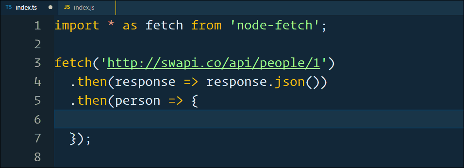
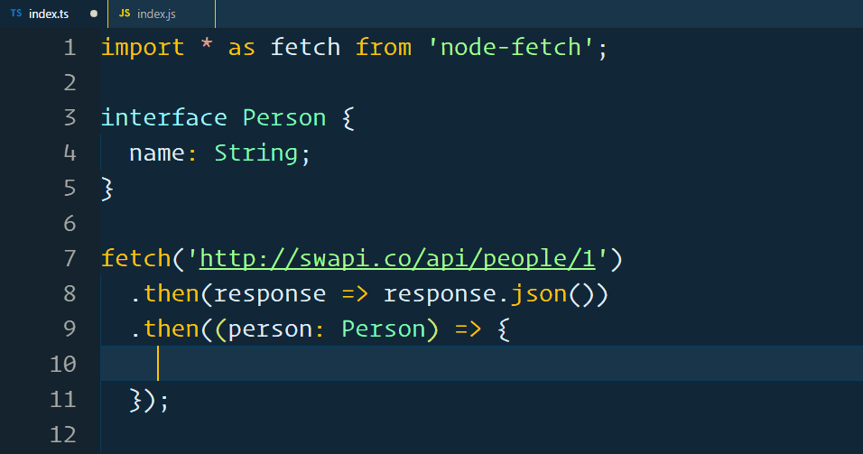
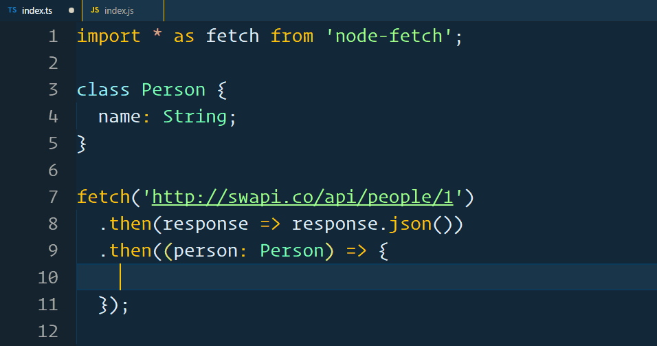

Neste artigo pretendo apresentar uma comparação entre a utilização de `classes` e `interfaces` para a representação do modelo de dados.

- Introdução
- Preparando o ambiente de desenvolvimento
- Construindo os testes
- Analisando o comportamento com Interfaces
- Analisando o comportamento com Classes
- Conclusão

## Introdução

`TypeScript` possui o conceito de `classes` e `interfaces`, onde ambos podem ser utilizados para representar o modelo de dados dos nossos objetos. Uma dúvida que encontro bastante em fóruns é a seguinte:

> Devo utilizar classes ou interfaces para representar meu modelo de dados?

O objetivo desse artigo é apresentar o veredicto final e esclarecer qualquer dúvida referente ao assunto.

## Preparando o ambiente de desenvolvimento

Nessa seção vou descrever os passos que utilizei para preparar o ambiente de desenvolvimento para realizar os testes de comparação.

- Criando o projeto

```bash
$ npm init -y
```

- Instalando as dependências de desenvolvimento

```bash
$ npm install --save-dev concurrently
$ npm install --save-dev typescript
```

- Criando o ponto de entrada

Criei o diretório `src` e dentro dele adicionei o arquivo `index.ts` com o seguinte conteúdo.

```typescript
console.log('It works!');
```

- Definindo as configurações de transpilação

Na raiz do projeto, criei o arquivo `tsconfig.json` com as seguintes configurações.

```json
{
  "compilerOptions": {
    "outDir": "./build",
    "allowJs": true,
    "target": "es5"
  },
  "include": ["./src/**/*"]
}
```

Esse arquivo irá transpilar os arquivos `.ts` que estão no diretório `src` para o diretório `build`.

- Configurando a transpilação e execução do projeto

Criei o `script` de inicialização do projeto no arquivo `package.json`.

```json
...
  "scripts": {
    "start": "concurrently \"tsc -w\" \"nodemon build/index.js\" "
  },
...
```

O comando `tsc -w` coloca o compilador em modo `watch` e a cada alteração nos arquivos do diretório `src`, o compilador transpila o código para o diretório `build` automaticamente. O comando `nodemon build/index.js` executa o projeto. Caso algum arquivo `.js` seja alterado, o `nodemon` reinicia a execução.

- Executando o projeto

```bash
$ npm start
```

- Validando o ambiente de desenvolvimento

O arquivo `index.js` deverá ser criado no diretório `build` e a saída do programa deverá ser `It works!`.

## Construindo os testes

O cenário mais comum para utilizarmos `classes` ou `interfaces` é quando fazemos chamadas em API para que os dados sejam exibidos em nosso front-end. Para a execução dos testes vou utilizar a biblioteca `node-fetch` e a API do Star Wars: [https://swapi.co/](https://swapi.co/).

- Instalando a biblioteca `node-fetch`

```bash
$ npm install node-fetch
```

- Construindo a chamada da API

```typescript
// src/index.ts

import * as fetch from 'node-fetch';

fetch('http://swapi.co/api/people/1')
  .then((response) => response.json())
  .then((person) => {
    console.log(person.name);
  });
```

O ponto mais importante a observar no código acima, é que `person` será **implicitamente** do tipo `any`, pois o compilador não tem como identificar seu tipo automaticamente. Como o tipo de `person` é `any`, o _IntelliSense_ não é capaz de reconhecer o tipo.



É nesse ponto que precisaremos definir o nosso modelo. E a pergunta que não quer calar:

> Devo utilizar classes ou interfaces?

## Analisando o comportamento com Interfaces

Para o nosso primeiro teste, iremos construir nosso modelo utilizando `interface`.

```typescript
// src/index.ts

import * as fetch from 'node-fetch';

interface Person {
  name: String;
}

fetch('http://swapi.co/api/people/1')
  .then((response) => response.json())
  .then((person: Person) => {
    console.log(person.name);
  });
```

No código acima, estamos definindo **explicitamente** que o tipo de `person` é `Person`. Como o tipo de `person` está explicitamente definido, o `IntelliSense` é capaz de reconhecer o tipo.



- Analisando o resultado da transpilação

Transpilando o código acima para `javascript` temos o seguinte resultado.

```javascript
// build/index.js

var fetch = require('node-fetch');
fetch('http://swapi.co/api/people/1')
  .then(function(response) {
    return response.json();
  })
  .then(function(person) {
    console.log(person.name);
  });
```

## Analisando o comportamento com Classes

Para o nosso último teste, iremos construir nosso modelo utilizando `class`.

```typescript
// src/index.ts

import * as fetch from 'node-fetch';

class Person {
  name: String;
}

fetch('http://swapi.co/api/people/1')
  .then((response) => response.json())
  .then((person: Person) => {
    console.log(person.name);
  });
```

No código acima, estamos definindo **explicitamente** que o tipo de `person` é `Person`. Como o tipo de `person` está explicitamente definido, o `IntelliSense` é capaz de reconhecer o tipo.



- Analisando o resultado da transpilação

Transpilando o código acima para `javascript` temos o seguinte resultado.

```javascript
// build/index.js

var fetch = require('node-fetch');
var Person = (function() {
  function Person() {}
  return Person;
})();
fetch('http://swapi.co/api/people/1')
  .then(function(response) {
    return response.json();
  })
  .then(function(person) {
    console.log(person.name);
  });
```

WOW 😯😯😯!

Reparem que a classe `Person` foi transpilada para o código `javascript` mas não é utilizada em nenhuma parte do código.

Esse código é totalmente inútil.

```javascript
// build/index.js

...
var Person = (function () {
    function Person() {
    }
    return Person;
}());
...
```

## Conclusão

Acredito que tenha ficado claro qual a melhor forma de representar os modelos de dados. As `interfaces` irão representar os dados, mas serão completamente removidas durante a transpilação. O grande problema de utilizar `classes` é a quantidade de código desnecessário que será gerado em um projeto com dezenas de objetos.
