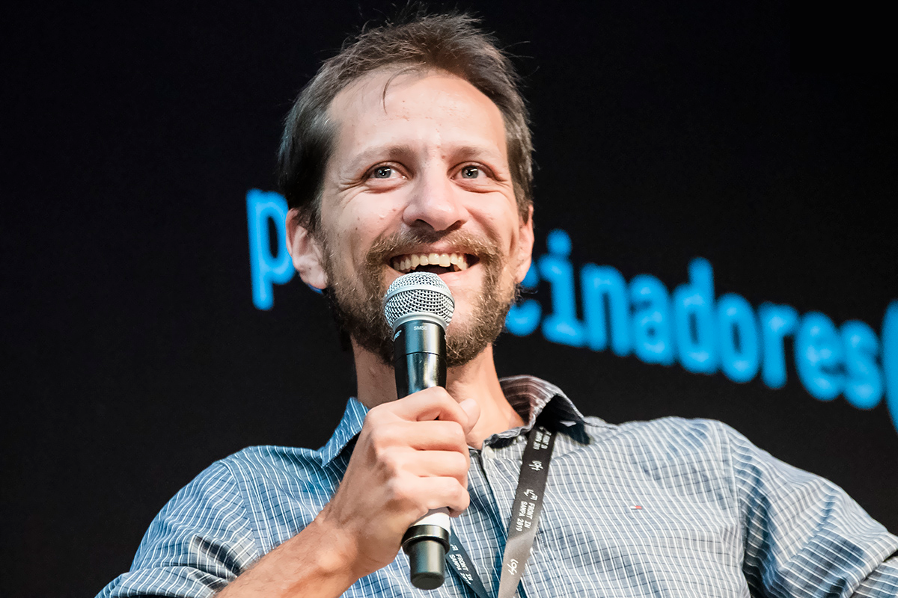

import SEO from '../components/SEO';

<SEO
  title="Sobre Roberto Achar"
  description="Conheça um pouco sobre a trajetória de Roberto Achar"
  slug="/about"
  />

# Sobre mim

Meu nome é Roberto Achar, sou Full Stack Web Developer. Nasci em 1981 na cidade de São Paulo e atualmente moro em [Itupeva][itupeva-link], uma cidade no interior de São Paulo. Sou casado com a Adriana e temos um filho chamado Eduardo.

Meu primeiro contato com programação foi em 1997 quando eu cursava Técnico em Processamento de Dados no [Colégio São Judas Tadeu](https://www.colegiosaojudas.com.br/). Meu primeiro emprego como desenvolvedor foi em 2003.

Larguei meu emprego no banco Itaú em 2017 e tenho trabalhado por conta própria para acompanhar de perto o crescimento do meu filho.

## Frontinsampa 2019

Fui convidado para participar da Talk do [Matheus Marsiglio](https://twitter.com/mtmr0x) no [Frontinsampa 2019](https://www.frontinsampa.com.br/). Que cara incrível, demos muitas risadas.

Agradeço de coração a [Keit Oliveira](https://twitter.com/seescrevekeit) pelo convite. Esse evento foi sensacional.

https://youtu.be/fKYE09GYTzw

## Entrevista no DevNaEstrada

Eu tive o prazer de ser convidado pelo [@femontanha](https://twitter.com/femontanha) e [@raymonsanches](https://twitter.com/raymonsanches) para participar do [DevNaEstrada](https://twitter.com/devnaestrada), um podcast sobre tecnologias e entrevistas com profissionais da área. Nessa entrevista eu contei um pouco sobre minha trajetória profissional como desenvolvedor.

Você pode ouvir minha entrevista no [Site do DevNaEstrada](https://devnaestrada.com.br/2017/10/13/roberto-achar.html), no [Spotify](https://open.spotify.com/episode/0fZTjSCm6VvjaJmUBR7YY6?si=oQlD6GZdSjiPR4sE9HuRVA) ou no [YouTube](https://www.youtube.com/watch?v=O3gB3yuQkAw).

https://twitter.com/RobertoAchar/status/918864444985348096

## Participação no Alura Live

Fui convidado pelo [@o_gabsferreira](https://twitter.com/o_gabsferreira) para participar do Alura Live, um programa da [Alura](https://www.alura.com.br/), uma plataforma brasileira de cursos de tecnologia. Nesse programa eu conversei sobre o tema Segurança da Informação.

Você pode assistir minha participação pelo [YouTube](https://youtu.be/3NK356O1LmU).

https://youtu.be/3NK356O1LmU

## Linha do tempo

Eu fiz um resumo da minha trajetória profissional como desenvolvedor.

- **1997**  
  Iniciei o curso Técnico em Processamento de Dados

- **1998**  
  Consegui meu primeiro estágio na Caixa Econômica Federal

- **1999**  
  Concluí o curso Técnico em Processamento de Dados 
  Fui contratado pela Rosch, empresa que prestava serviço para a Caixa Econômica Federal

- **2000-2002**  
  Trabalhei na empresa [Procimar Cine Vídeo](http://www.procimar.com.br/), digitalizando fitas VHS para DVD e disco vinil para CD

- **2003-2004**  
  Consegui meu primeiro emprego como Desenvolvedor Júnior na empresa [Besafer Intelligence](http://besafer.com.br/)

- **2005-2006**  
  Líder Técnico na [Prefeitura de Mauá](http://www.maua.sp.gov.br/)

- **2007-2010**  
  Desenvolvedor Sênior nas empresas DRM Serviços de Consultoria, [Danresa Security and Network Solutions](http://www.danresa.com.br), Diretotal, Palco07, Oficina de Design e BSI Tecnologia 
  Trabalhei em projetos do UOL, Itaú, Itaú BBA, Sem Parar, Tinta Suvinil, Coca-Cola, Castrol

- **2011-2016**  
  Analista de Segurança da Informação no banco [Itaú](https://www.itau.com.br/)

- **2017-2019**  
  _Home Office_ 😎  
  Consultor independente trabalhando em projetos para a área de Segurança da Informação

[itupeva-link]: https://www.google.com/maps/place/Itupeva,+State+of+S%C3%A3o+Paulo/@-23.1545841,-47.0668176,14z/data=!3m1!4b1!4m5!3m4!1s0x94cf30d56621a3c9:0xd7fe5ed81a7951c0!8m2!3d-23.1550145!4d-47.0524585
